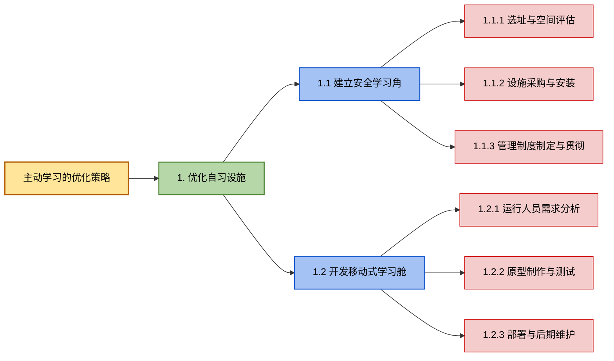

```mermaid
flowchart LR
%% 一级：主题
A[主动学习的优化策略]:::lv1

%% 二级：主策略
A --> B1[1. 优化自习设施]:::lv2

%% 三级：两大方向
B1 --> B11[1.1 建立安全学习角]:::lv3
B1 --> B12[1.2 开发移动式学习舱]:::lv3

%% 四级：建立安全学习角的子项
B11 --> B111[1.1.1 选址与空间评估]:::lv4
B11 --> B112[1.1.2 设施采购与安装]:::lv4
B11 --> B113[1.1.3 管理制度制定与贯彻]:::lv4

%% 四级：学习舱的子项
B12 --> B121[1.2.1 运行人员需求分析]:::lv4
B12 --> B122[1.2.2 原型制作与测试]:::lv4
B12 --> B123[1.2.3 部署与后期维护]:::lv4

%% 层级颜色样式定义
classDef lv1 fill:#ffe599,stroke:#b45f06,stroke-width:2px,color:#000
classDef lv2 fill:#b6d7a8,stroke:#38761d,stroke-width:1.5px,color:#000
classDef lv3 fill:#a4c2f4,stroke:#1155cc,stroke-width:1.5px,color:#000
classDef lv4 fill:#f4cccc,stroke:#cc0000,stroke-width:1px,color:#000
```
