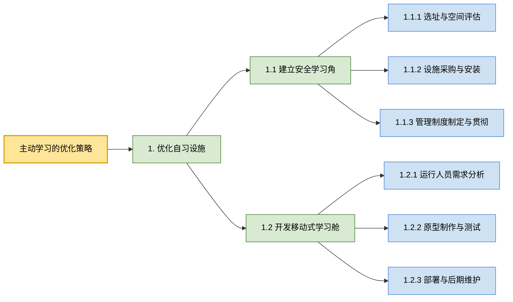

```mermaid
flowchart LR
    %% 样式定义
    classDef main fill:#ffe599,stroke:#d99900,stroke-width:2px,color:#000
    classDef sub fill:#d9ead3,stroke:#38761d,stroke-width:1px,color:#000
    classDef leaf fill:#cfe2f3,stroke:#3c78d8,stroke-width:1px,color:#000

    %% 一级标题
    A[主动学习的优化策略]:::main

    %% 二级层级：优化自习设施
    A --> A1[1. 优化自习设施]:::sub

    %% 三级层级：安全学习角、移动式学习舱
    A1 --> A11[1.1 建立安全学习角]:::sub
    A1 --> A12[1.2 开发移动式学习舱]:::sub

    %% 四级层级：安全学习角子项
    A11 --> A111[1.1.1 选址与空间评估]:::leaf
    A11 --> A112[1.1.2 设施采购与安装]:::leaf
    A11 --> A113[1.1.3 管理制度制定与贯彻]:::leaf

    %% 四级层级：移动学习舱子项
    A12 --> A121[1.2.1 运行人员需求分析]:::leaf
    A12 --> A122[1.2.2 原型制作与测试]:::leaf
    A12 --> A123[1.2.3 部署与后期维护]:::leaf
```
